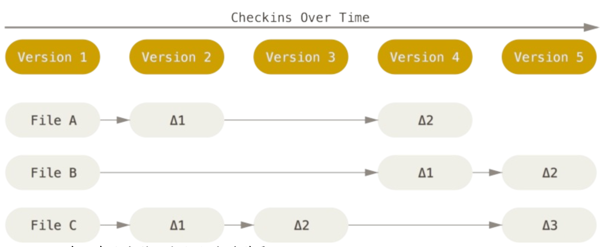
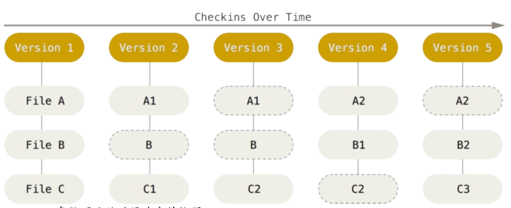

# [Git 札记 3] Git基本概念及配置

很多时候使用 Git 时，仅仅使用常用的几条命令，比如：`git add .`,  `git commmit -m 'commit'`,  `git push origin master`  ，但并没有真正的理解Git，若能理解Git的思想和基本工作原理，用起来会知其所以然，游刃有余。

<!--more-->

[TOC]

## Git 的基本概念

### Git 的四个特性

1. 直接记录快照，而非差异对比

其他版本控制系统：  

Git ：



相比其他版本控制系统进保存修改内容，Git 每次对全部文件制作快照并保存索引。

2. 几乎所有操作都是本地执行

3. Git 保证完整性

4. Git 一般只添加数据


### 三个状态

1. Committed （已提交）
2. Modified     （已修改）
3. Staged         （已暂存）


## Git 配置

### 配置文件位置

1. `/etc/gitconfig` ：系统中每个用户和他们仓库的通用配置，`--system` 调用
2. `~/.gitconfig` 或 `~/.config/git/config` ：当前用户的配置， `--global` 调用
3. 当前仓库的Git 目录中的 `config`  文件( `.git/config` )， 默认调用


### 如何配置

1. 配置用户信息

```bash
git config --global user.name "Shuangzhen"
git config --global user.email "dreamre21@gmail.com"
```

2. 检查配置信息

```bash
git config user.name
git config user.email
vi ~/.gitconfig
```

3. 帮助信息

```bash
git help <verb>
git <verb> help
man git-<verb>
```

 

